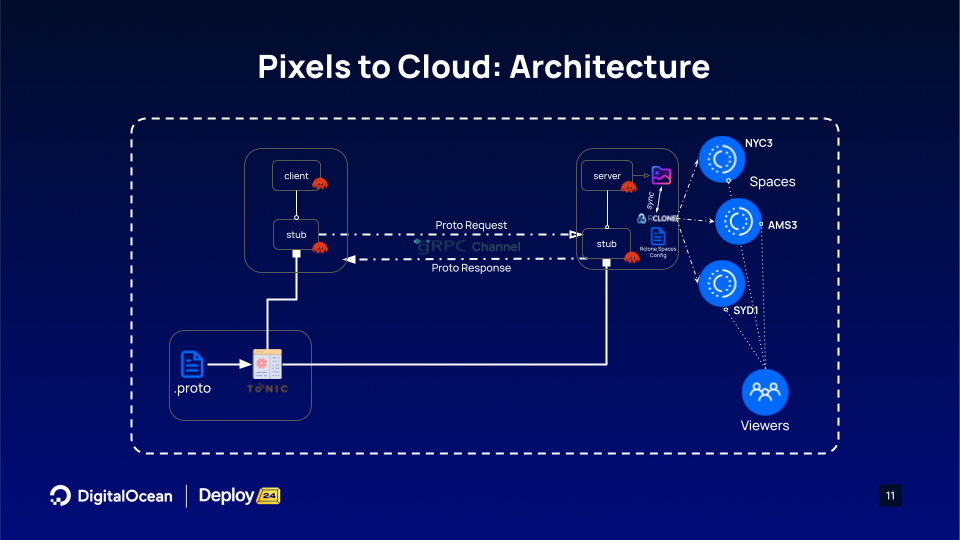

# pixels-to-cloud

`pixels-to-cloud` is a photo-editor app that aims to inspire developers to create high-performance, scalable, distributed systems. By leveraging technologies such as [gRPC](https://github.com/grpc) and DigitalOcean Object Storage [(Spaces)](https://www.digitalocean.com/products/spaces), this project showcases the potential of modern tech stacks to build robust and efficient application architectures.

Here is the overview of the architecture:



## Prerequisites

- **[Rust](https://www.rust-lang.org/tools/install)**
  - Includes [Cargo: Rust package manager](https://github.com/rust-lang/cargo)
- **[DigitalOcean Account](https://cloud.digitalocean.com/registrations/new?refcode=f6fcd01aaffb)**
  - To create and access [DO Object Storages: Spaces](https://www.digitalocean.com/products/spaces)
- **[Rclone](https://rclone.org/)**
  - Spaces sync across different geographies

## Setting Up DigitalOcean Spaces & Rclone

To create three DigitalOcean Spaces instances in NYC, AMS, and SYD, follow these steps:

1. **Log in to Your DigitalOcean Account:**
   - Go to [DigitalOcean](https://cloud.digitalocean.com/registrations/new?refcode=f6fcd01aaffb) and log in.

2. **Navigate to Spaces Object Storage:**
   - Access the Spaces section: [DigitalOcean Spaces](https://cloud.digitalocean.com/spaces).

3. **Create Spaces across three Data Centers:**
   - Choose data center regions:
     - **NYC**: "New York(nyc3)"
     - **AMS**: "Amsterdam(ams3)"
     - **SYD**: "Sydney(syd1)"
   - Name your Spaces (e.g., `pixbox-nyc`, `pixbox-ams`, `pixbox-syd`).
   - Adjust settings as needed and click "Create a Spaces Bucket".
   - For more details, refer to the [DigitalOcean Spaces Documentation](https://www.digitalocean.com/docs/spaces/).

4. **Generate Spaces Access Keys:**
   - Go to the [API section](https://cloud.digitalocean.com/account/api/tokens) to generate new Spaces Keys.
   - Copy the **Access Key** and **Secret Key** and store them securely.

5. **Configure Spaces Access using Rclone:**
   - Run `rclone config` to set up the rclone configuration
   - Your configuration file should be similar to the one below:

    ```bash
    # Rclone configuration example
    [pixbox-ams]
    type = s3
    provider = DigitalOcean
    env_auth = false
    access_key_id = <Access Key>
    secret_access_key = <Secret>
    endpoint = ams3.digitaloceanspaces.com
    acl = 

    [pixbox-syd]
    type = s3
    provider = DigitalOcean
    env_auth = false
    access_key_id = <Access Key>
    secret_access_key = <Secret>
    endpoint = syd1.digitaloceanspaces.com
    acl = 

    [pixbox-nyc]
    type = s3
    provider = DigitalOcean
    env_auth = false
    access_key_id = <Access Key>
    secret_access_key = <Secret>
    endpoint = nyc3.digitaloceanspaces.com
    acl = 
    ```

## Run the demo

```bash
git clone https://github.com/digitalocean/pixels-to-cloud.git
cd pixels-to-cloud
```

There are three main components:

- [`client`](./src/client.rs)
- [`server`](./src/server.rs)
- [`synchronizer`](./scripts/spaces-sync.sh)

For ease of usage, we have created a [`Makefile`](Makefile) with all the necessary commands to build/run the project.

### Start the Server
  
  ```bash
  # The server will start listening on localhost:9001
  make run
  # The above make command translates to
  cargo run --release --bin server
  ```

### Start the Rclone Synchronizer

   ```bash
   ./scripts/spaces-sync.sh <path to the directory to be synced>
   # Example
   ./scripts/spaces-sync.sh ./images/edited 
   ```

### Using the Client

```bash
# The client is used to upload the image to be edited to the server.
make upload
# The above make command translates to
cargo run --bin client upload --imgpath </path/to/your/image>
```

## Acknowledgments

- [Photon: Image Processing Library in WebAssembly/Rust](https://silvia-odwyer.github.io/photon/)
- [gRPC Community](https://grpc.io/community/)
- [Cape Breton](./images/marg-cape-breton.jpg): Photo Courtesy - Margaret MacAfee

## References

- [Postman: What is gRPC?](https://blog.postman.com/what-is-grpc/)
- [gRPC over HTTP/2 in Rust](https://www.linkedin.com/pulse/grpc-over-http2-rust-luis-soares-m-sc-/)
- [Tonic: gRPC Client and Server Implementation](https://www.youtube.com/watch?v=kerKXChDmsE)
